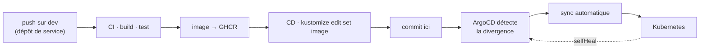

# wely-gitops-infra

Infrastructure déclarative de la plateforme [Wely Calendar](https://github.com/banettetheo) : manifestes Kubernetes organisés en Kustomize, applications ArgoCD, secrets chiffrés.

**Ce dépôt est la source de vérité de l'état du cluster.** Aucun déploiement ne se fait par `kubectl apply` manuel.

---

## Le modèle GitOps



La CD d'un service **ne parle jamais au cluster**. Elle met à jour le tag d'image dans ce dépôt, et ArgoCD — qui le surveille avec `automated.selfHeal: true` et `prune: true` — réconcilie l'état réel.

Deux conséquences :

- **L'état du cluster est lisible dans Git**, pas dans l'historique d'un pipeline. `git log` répond à « qu'est-ce qui tourne, depuis quand, poussé par quoi ».
- **Une modification manuelle du cluster est annulée automatiquement.** `selfHeal` garantit qu'aucune dérive ne survit.

---

## Structure

```
├── argocd/
│   └── applications.yaml         Applications ArgoCD (dev, prod)
├── base/                         manifestes communs à tous les environnements
│   ├── wely-gateway.yaml         ─┐
│   ├── wely-users.yaml            │  services applicatifs
│   ├── wely-social.yaml           │
│   ├── wely-chat.yaml             │
│   ├── wely-events.yaml           │
│   ├── wely-web.yaml             ─┘
│   ├── wely-auth.yaml            Keycloak
│   ├── wely-postgres-auth.yaml   ─┐
│   ├── wely-postgres-users.yaml   │  bases de données
│   ├── wely-mongodb.yaml          │  (StatefulSets)
│   ├── wely-neo4j.yaml           ─┘
│   ├── wely-kafka.yaml           broker + UI
│   ├── wely-redis.yaml           compteurs de quota de la gateway (sans persistance)
│   ├── cloudflared.yaml          tunnel Cloudflare (exposition publique)
│   └── wely-tailscale.yaml       opérateur Tailscale (accès administrateur)
└── overlays/
    ├── local/                    Kubernetes local — secrets en clair, images locales
    ├── dev/                      cluster Raspberry Pi — SealedSecrets, images par SHA
    └── prod/                     namespace séparé, réplicas augmentés
```

### Composition Kustomize

```
                      ┌──────────────────┐
                      │       base/      │   déploiements, services,
                      │                  │   StatefulSets, config commune
                      └────────┬─────────┘
                ┌──────────────┼──────────────┐
                ▼              ▼              ▼
        ┌─────────────┐ ┌─────────────┐ ┌─────────────┐
        │   local/    │ │    dev/     │ │   prod/     │
        │             │ │             │ │             │
        │ ns: wely-   │ │ namePrefix  │ │ ns: wely-   │
        │     local   │ │   dev-      │ │     prod    │
        │ secrets     │ │ SealedSecr. │ │ replicas: 2 │
        │  en clair   │ │ images @SHA │ │             │
        └─────────────┘ └─────────────┘ └─────────────┘
```

---

## Gestion des secrets

Les secrets de l'environnement `dev` sont chiffrés avec **Sealed Secrets** et committés sans risque : seul le contrôleur installé dans le cluster détient la clé de déchiffrement.

```bash
kubeseal --format yaml < secret.yaml > overlays/dev/wely-sealed-secrets-dev.yaml
```

C'est ce qui rend le modèle GitOps praticable : sans cela, il faudrait une source de secrets hors Git et l'état du cluster ne serait plus entièrement décrit par le dépôt.

L'overlay `local` utilise des secrets en clair, délibérément — il ne cible qu'un cluster de développement sur poste.

---

## Exposition réseau

| Composant | Rôle |
|---|---|
| **Cloudflare Tunnel** | Expose la gateway et Keycloak sur Internet sans ouvrir de port entrant ni IP publique |
| **Tailscale Operator** | Accès administrateur au cluster (kubectl, bases) via réseau privé |

Le cluster tourne sur un ensemble de Raspberry Pi derrière une connexion résidentielle : le tunnel sortant est ce qui rend l'exposition possible sans IP fixe.

---

## Environnement local

Toute la plateforme démarre en une commande sur un Kubernetes local.

### Prérequis

Un Kubernetes local — [OrbStack](https://orbstack.dev/) (recommandé), Docker Desktop, Minikube ou k3d — et `kubectl`.

```bash
kubectl apply -k overlays/local --server-side
```

Cela déploie le namespace `wely-local`, les quatre bases, Keycloak, la gateway, le frontend et les quatre microservices, avec leurs secrets locaux préconfigurés.

| Service | URL |
|---|---|
| Frontend | http://localhost |
| Keycloak | http://localhost:8080 *(admin / admin)* |
| Gateway | http://localhost:8081 |

```bash
kubectl delete -k overlays/local        # nettoyage
```

Voir [`README-LOCAL.md`](README-LOCAL.md) pour le détail.

---

## Commandes utiles

```bash
kubectl kustomize overlays/dev          # rendu des manifestes sans appliquer
kubectl kustomize overlays/prod
kubectl apply -k overlays/local --server-side

argocd app list
argocd app get wely-dev
argocd app diff wely-dev                # écart entre Git et le cluster
```

> **Ne jamais faire de `kubectl apply` sur `dev` ou `prod`** : ArgoCD annulerait la modification au prochain cycle de réconciliation. Le chemin normal est un commit sur ce dépôt.

---

## Limites connues

- **Keycloak n'a pas de probes.** Ses endpoints de santé ont changé de port en version 25 (`:9000/health/ready` au lieu de `:8080/health/ready`), et l'image est construite sur `quay.io/keycloak/keycloak:latest` : impossible de savoir lequel s'applique avant d'épingler le tag. Une probe sur le mauvais port mettrait l'IdP en `CrashLoopBackOff` et couperait toute la plateforme. **Prérequis : épingler l'image.**
- **Le frontend n'a pas `readOnlyRootFilesystem`.** `entrypoint.sh` réécrit `index.html` au démarrage pour injecter `KEYCLOAK_URL`, et nginx écrit son cache. Servir cette configuration depuis un ConfigMap au lieu de muter l'artefact permettrait de verrouiller ce conteneur aussi.
- **Pas de `NetworkPolicy`** : tout pod peut joindre tout autre pod, y compris les bases.
- **L'overlay `prod` n'est pas opérationnel** : il utilise `newTag: latest` — non reproductible et indétectable par ArgoCD — et ne définit aucun Secret, alors que la base y fait référence.
- **Les patches de l'overlay `dev` sont positionnels** (`/env/0/value`, `/env/1/value`…). Insérer une variable d'environnement dans la base décale tous les indices et réaffecte silencieusement les mauvaises valeurs. À remplacer par des patches stratégiques nommés.
- **La base référence un Secret préfixé `dev-`**, ce qui inverse la logique Kustomize : la base ne devrait rien savoir des overlays.
- **Secrets en clair dans `base/wely-secrets-dev.yaml`** — à remplacer par un SealedSecret ou un fichier d'exemple.
- **Pas de HPA ni de PodDisruptionBudget.**
